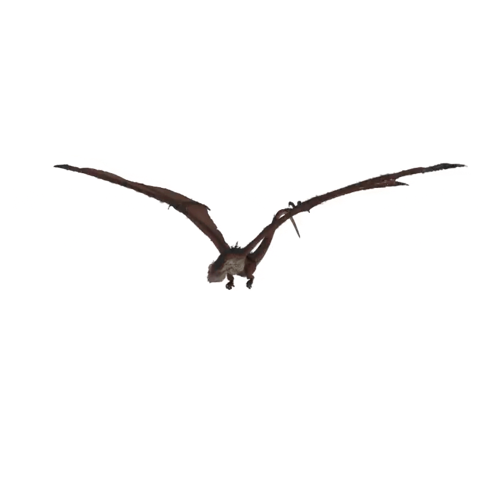

# Point-Based Radiance Fields for Controllable Human Motion Synthesis

## [Project Page](https://dehezhang2.github.io/Point_Based_NeRF_Editing/)

Authors:[Deheng Zhang*](https://github.com/dehezhang2), [Haitao Yu*](https://github.com/sputnik524), [Peiyuan Xie*](https://github.com/xpy1009), [Tianyi Zhang*](https://github.com/TianyiZhang-arc)

This is a repository containing the official implementation of ***Point-Based Radiance Fields for Controllable Human Motion Synthesis***. 

## Overview


Our method exploits the explicit point cloud to train the static 3D scene and apply the deformation by encoding the point cloud translation using a deformation MLP. To make sure the rendering result is consistent with the canonical space training, we estimate the local rotation using SVD and interpolate the per-point rotation to the query view direction of the pre-trained radiance field. Extensive experiments show that our approach can significantly outperform the state-of-the-art on fine-level complex deformation which can be generalized to other 3D characters besides humans. 

## Demo

|  |  |  |
| ------------------------------------------------------------ | -------------------------------------------------------- | ---------------------------- |

## Overall Instruction

1. Please first install the libraries as below and download/prepare the datasets as instructed.
2. Point Initialization: Download pre-trained MVSNet as below and train the feature extraction from scratch or directly download the pre-trained models. (Obtain `MVSNet` and `init` folder in checkpoints folder)
3.  Per-scene Optimization: Download pre-trained models or optimize from scratch as instructed.

## Installation

### Requirements

All the codes are tested in the following environment: Python 3.8; Ubuntu 20.04; CUDA > 11.7.

### Install

* Install the environment from `yml`:

  ```bash
  conda env create -f environment.yml
  ```

* Install `pytorch3d`

  ```bash
  conda activate point-nerf-editing
  pip install fvcore iopath
  pip install --no-index --no-cache-dir pytorch3d -f https://dl.fbaipublicfiles.com/pytorch3d/packaging/wheels/py39_cu117_pyt1131/download.html
  ```
## Data Preparation

We provide all data folder here: [polybox](https://polybox.ethz.ch/index.php/s/L1hEW3abDCQkeOm), please put the folders in the following directory. 
```
pointnerf
├── data_src
│   ├── nerf
    │   │   │──nerf_synthetic
```
Alternatively, you can follow the instruction in [PointNeRF-Assistant](https://github.com/dehezhang2/PointNeRF-Assistant) to create your own dataset, the data format should be the same as `nerf_sythetic` dataset. 

## Initialization and Optimization:

### Download pre-trained MVSNet checkpoints:

We trained [MVSNet](https://github.com/xy-guo/MVSNet_pytorch) on DTU. You can Download ''MVSNet'' directory from [google drive](https://drive.google.com/drive/folders/1xk1GhDhgPk1MrlX8ncfBz5hNMvSa9vS6?usp=sharing) and place them under `checkpoints/`.

### Download per-scene optimized Point-NeRFs

 You can skip training and download the checkpoint folders of `nerfsynth` here [polybox](https://polybox.ethz.ch/index.php/s/ygXCSXUa6ORjCws), and place them in the following directory.

```
pointnerf
├── checkpoints
│   ├── init
    ├── MVSNet
    ├── nerfsynth
```

In each scene, we provide points and weights at 200K steps `200000_net_ray_marching.pth`.

### Canonical Scene Optimization

<details>
  <summary>train scripts</summary>

```
    bash dev_scripts/w_n360/dragon_cuda.sh
    bash dev_scripts/w_n360/gangnam_cuda.sh
    bash dev_scripts/w_n360/human_cuda.sh
    bash dev_scripts/w_n360/phoenix_cuda.sh
    bash dev_scripts/w_n360/robot_cuda.sh
    bash dev_scripts/w_n360/samba_cuda.sh
    bash dev_scripts/w_n360/spiderman_cuda.sh
    bash dev_scripts/w_n360/turtle_cuda.sh
    bash dev_scripts/w_n360/woman_cuda.sh
```
</details>

### Point Cloud Deformation

<details>
  <summary>deformation scripts</summary>

```
    bash dev_scripts/w_n360/dragon_deform.sh
    bash dev_scripts/w_n360/gangnam_deform.sh
    bash dev_scripts/w_n360/human_deform.sh
    bash dev_scripts/w_n360/phoenix_deform.sh
    bash dev_scripts/w_n360/robot_deform.sh
    bash dev_scripts/w_n360/samba_deform.sh
    bash dev_scripts/w_n360/spiderman_deform.sh
    bash dev_scripts/w_n360/turtle_deform.sh
    bash dev_scripts/w_n360/woman_deform.sh
```

</details>

*Notes on the configuration in* `deform.sh`

  ```
  ray_bend=0 # 0: no bending; 1: use ray bending
  sample_num -1 # -1: use whole set of keypoints; 0~1: ratio from the original keypoint; >1: number of keypoints
  ```
## Reference
```
@article{zhang2023accessible,
  title={Accessible Robot Control in Mixed Reality},
  author={Zhang, Ganlin and Zhang, Deheng and Duan, Longteng and Han, Guo},
  journal={arXiv preprint arXiv:2306.02393},
  year={2023}
}
```
## Acknowledgement

Our repo is developed based on [MVSNet](https://github.com/YoYo000/MVSNet),  [PointNeRF](https://github.com/Xharlie/pointnerf), [DPF](https://github.com/sergeyprokudin/dpf). Please also consider citing the corresponding papers. We thank our supervisor [**Dr. Sergey Prokudin**](https://inf.ethz.ch/people/people-atoz/person-detail.MjgzODM4.TGlzdC8zMDQsLTIxNDE4MTU0NjA=.html) from [Computer Vision and Learning Group ETH Zurich](https://vlg.inf.ethz.ch/) for the help and tons of useful advice for this project.

## LICENSE

The code is released under the GPL-3.0 license.
